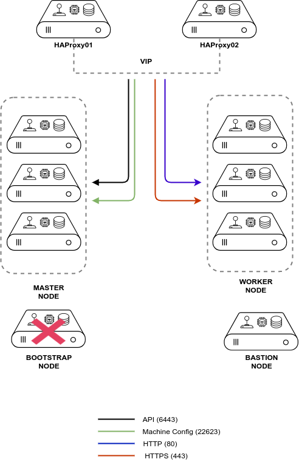
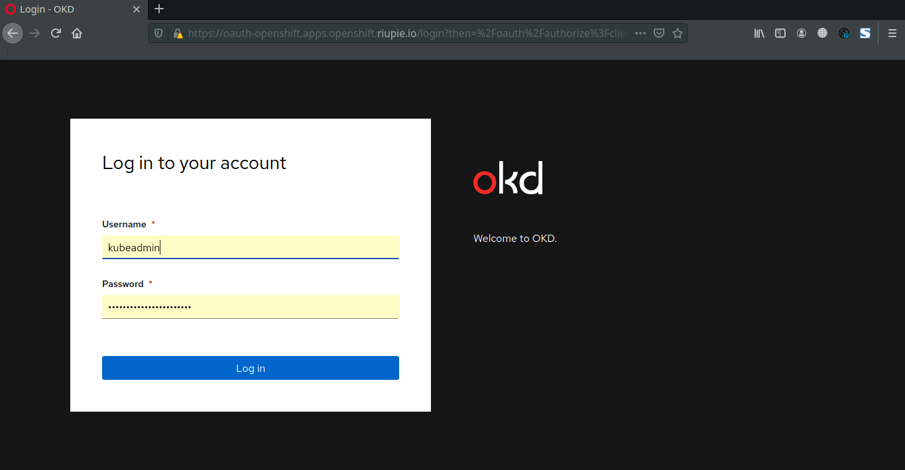

## Environment


<table class="table table-striped" >
  <thead>
    <tr>
      <th scope="col">IP Address</th>
      <th scope="col">Hostname</th>
      <th scope="col">OS</th>
      <th scope="col">Description</th>
    </tr>
  </thead>
	<tbody>
		<tr>
			<td>10.10.51.9</td>
			<td>okd-bastion</td>
			<td>CentOS 8</td>
			<td>DNS Server, DHCP Server, NTP Server, PXE Server, LDAP Server</td>
		</tr>
		<tr>
			<td>10.10.51.10</td>
			<td>okd-bootstrap</td>
			<td>Fedora COreOS</td>
			<td>Bootstrap Server. Temporary only, could be delete after bootstrapping done.</td>
		</tr>
		<tr>
			<td>10.10.51.11</td>
			<td>okd-master01</td>
			<td>Fedora CoreOS</td>
			<td>Master</td>
		</tr>
		<tr>
			<td>10.10.51.12</td>
			<td>okd-master02</td>
			<td>Fedora CoreOS</td>
			<td>Master</td>
		</tr>
		<tr>
			<td>10.10.51.13</td>
			<td>okd-master03</td>
			<td>Fedora CoreOS</td>
			<td>Master</td>
		</tr>
		<tr>
			<td>10.10.51.21</td>
			<td>okd-worker01</td>
			<td>Fedora CoreOS</td>
			<td>Worker</td>
		</tr>
		<tr>
			<td>10.10.51.22</td>
			<td>okd-worker02</td>
			<td>Fedora CoreOS</td>
			<td>Worker</td>
		</tr>
			<td>10.10.51.31</td>
			<td>okd-lb1</td>
			<td>CentOS 8</td>
			<td>Load Balancer</td>
		</tr>
			<td>10.10.51.32</td>
			<td>okd-lb2</td>
			<td>CentOS 8</td>
			<td>Load Balancer</td>
		</tr>
	</tbody>
</table>


##  Part 1: Bastion/Helper Server
### 1. Setup DNS Server
#### 1.1. Install Bind Packages
```bash
yum install -y vim bind bind-utils
```
#### 1.2. Define Zone in the end of file 
```bash
vim /etc/named.conf
```
```conf

options {
	directory 	"/var/named";
	dump-file 	"/var/named/data/cache_dump.db";
	statistics-file "/var/named/data/named_stats.txt";
	memstatistics-file "/var/named/data/named_mem_stats.txt";
	secroots-file	"/var/named/data/named.secroots";
	recursing-file	"/var/named/data/named.recursing";
	allow-query     { localhost;10.10.51.0/24; };
    listen-on port 53 { any; };

	recursion yes;
        forwarders {
                8.8.8.8;
                8.8.4.4;
        };
	dnssec-enable yes;
	dnssec-validation yes;

	managed-keys-directory "/var/named/dynamic";

	pid-file "/run/named/named.pid";
	session-keyfile "/run/named/session.key";

	/* https://fedoraproject.org/wiki/Changes/CryptoPolicy */
	include "/etc/crypto-policies/back-ends/bind.config";
};

logging {
        channel default_debug {
                file "data/named.run";
                severity dynamic;
        };
};

zone "." IN {
	type hint;
	file "named.ca";
};

zone "openshift.riupie.io" {
        type master;
        file "dynamic/forward.db";
};

zone "51.10.10.in-addr.arpa" {
        type master;
        file "dynamic/reverse.db";
};

include "/etc/named.rfc1912.zones";
include "/etc/named.root.key";
```
#### 1.3. Create zone files
```bash
vim /var/named/dynamic/forward.db
```
```conf
$TTL 1W
@	IN	SOA	ns1.openshift.riupie.io.	root (
			2020092301	; serial
			3H		    ; refresh (3 hours)
			30M		    ; retry (30 minutes)
			2W	    	; expiry (2 weeks)
			1W )		; minimum (1 week)
	IN	NS	ns1.openshift.riupie.io.
	IN	MX 10	smtp.openshift.riupie.io.
;
; 
ns1	  IN	A	10.10.51.9
smtp	IN	A	10.10.51.9
;
bastion	IN	A	10.10.51.9
;
; The api points to the IP of your load balancer
api		IN	A	10.10.51.100
api-int		IN	A	10.10.51.100
;
; The wildcard also points to the load balancer
*.apps		IN	A	10.10.51.100
;
; Create entry for the bootstrap host
bootstrap	IN	A	10.10.51.10
;
; Create entries for the master hosts
master01		IN	A	10.10.51.11
master02		IN	A	10.10.51.12
master03		IN	A	10.10.51.13
;
; Create entries for the worker hosts
worker01		IN	A	10.10.51.21
worker02		IN	A	10.10.51.22
;
; The ETCd cluster lives on the masters...so point these to the IP of the masters
etcd-0	IN	A	10.10.51.11
etcd-1	IN	A	10.10.51.12
etcd-2	IN	A	10.10.51.13
;
; The SRV records are IMPORTANT....make sure you get these right...note the trailing dot at the end...
_etcd-server-ssl._tcp	IN	SRV	0 10 2380 etcd-0.openshift.riupie.io.
_etcd-server-ssl._tcp	IN	SRV	0 10 2380 etcd-1.openshift.riupie.io.
_etcd-server-ssl._tcp	IN	SRV	0 10 2380 etcd-2.openshift.riupie.io.
;
```

#### 1.4. Create Reverse Zone File
```bash
vim /var/named/dynamic/reverse.db
```
```conf
$TTL 1W
@	IN	SOA	ns1.openshift.riupie.io.	root (
			2020092301	; serial
			3H		    ; refresh (3 hours)
			30M		    ; retry (30 minutes)
			2W		    ; expiry (2 weeks)
			1W )		; minimum (1 week)
	IN	NS	ns1.openshift.riupie.io.
;
; syntax is "last octet" and the host must have fqdn with trailing dot

9   IN  PTR bastion.openshift.riupie.io.

11	IN	PTR	master01.openshift.riupie.io.
12	IN	PTR	master02.openshift.riupie.io.
13	IN	PTR	master03.openshift.riupie.io.
;
10	IN	PTR	bootstrap.openshift.riupie.io.
;
100	IN	PTR	api.openshift.riupie.io.
100	IN	PTR	api-int.openshift.riupie.io.
;
21	IN	PTR	worker01.openshift.riupie.io.
22	IN	PTR	worker02.openshift.riupie.io.
;
```
#### 1.5. Enable and start bind service
```bash
systemctl enable named
systemctl restart named
systemctl status named
```
#### 1.6. Allow firewall
```bash
firewall-cmd   --permanent --add-service=dns --zone=public  --permanent
firewall-cmd --reload
```

#### 1.7. Change DNS Server on Bastion
```bash
#Change DNS Server
nmtui

#Restart interface
ifdown ens3;ifup en3
```
#### 1.8. Verify DNS Server works
```bash
nslookup api.openshift.riupie.io
```

### 2. Setup DHCP Server
#### 2.1. Install dhcp-server package
```bash
yum install dhcp-server -y
```
#### 2.2. Configure DHCP Leases
```bash
vim /etc/dhcp/dhcpd.conf
```
```conf
ddns-update-style interim;
ignore client-updates;
authoritative;
allow booting;
allow bootp;
allow unknown-clients;

# internal subnet for my DHCP Server
subnet 10.10.51.0 netmask 255.255.255.0 {
range 10.10.51.200 10.10.51.210;
option domain-name-servers 10.10.51.9;
option routers 10.10.51.1;
option broadcast-address 10.10.51.255;
default-lease-time 600;
max-lease-time 7200;

host bootstrap.openshift.riupie.io { hardware ethernet 52:54:00:19:24:45; fixed-address 10.10.51.10; }

host master01.openshift.riupie.io { hardware ethernet 52:54:00:63:9b:49; fixed-address 10.10.51.11; }
host master02.openshift.riupie.io { hardware ethernet 52:54:00:06:2c:9b; fixed-address 10.10.51.12; }
host master03.openshift.riupie.io { hardware ethernet 52:54:00:93:87:91; fixed-address 10.10.51.13; }

host worker01.openshift.riupie.io { hardware ethernet 52:54:00:10:d4:f3; fixed-address 10.10.51.21; }
host worker02.openshift.riupie.io { hardware ethernet 52:54:00:18:59:d2; fixed-address 10.10.51.22; }

deny unknown-clients;


# IP of PXE Server
next-server 10.10.51.9;
if exists user-class and option user-class = "iPXE" {

filename "http://bastion.openshift.riupie.io:8080/boot.ipxe";

} else {

filename "undionly.kpxe";

}
}
```
#### 2.3. Restart and enable dhcp service
```bash
systemctl enable dhcpd
systemctl restart dhcpd
systemctl status dhcpd
```

#### 2.4. Set firewall
```bash
sudo firewall-cmd --add-service=dhcp --permanent
sudo firewall-cmd --reload
```
### 3. Setup PXE Boot Server
#### 3.1. Install tftp-server package
```bash
yum install tftp-server ipxe-bootimgs -y

ln -s /usr/share/ipxe/undionly.kpxe /var/lib/tftpboot
```

#### 3.2. Download and Extract Matchbox
```bash
curl -LO https://github.com/poseidon/matchbox/releases/download/v0.8.3/matchbox-v0.8.3-linux-amd64.tar.gz
tar xvzf matchbox-v0.8.3-linux-amd64.tar.gz 
```

#### 3.3. Move matchbox binary
```bash
cd matchbox-v0.8.3-linux-amd64
cp matchbox /usr/local/bin/
```

#### 3.4. Create matchbox user for matchbox service
```bash
useradd -U matchbox
```
#### 3.5. Create configuration directory for matchbox
```bash
mkdir -p /var/lib/matchbox/{assets,groups,ignition,profiles}

chown -R matchbox:matchbox /var/lib/matchbox
```
#### 3.6. Start and enable TFTP Service
```bash
systemctl enable tftp
systemctl restart tftp
```
#### 3.7. Set firewalld for TFTP
```bash
firewall-cmd --permanent --add-service=tftp
firewall-cmd --reload
```

#### 3.8. Create, enable and start matchbox systemd service
```bash
cp contrib/systemd/matchbox-local.service /etc/systemd/system/matchbox.service

systemctl daemon-reload
systemctl enable matchbox
systemctl restart matchbox
```

#### 3.9. Download Fedora CoreOS assets
```bash
cd /var/lib/matchbox/assets

wget https://builds.coreos.fedoraproject.org/prod/streams/stable/builds/32.20200907.3.0/x86_64/fedora-coreos-32.20200907.3.0-live-kernel-x86_64 -O fcos-32-kernel
wget https://builds.coreos.fedoraproject.org/prod/streams/stable/builds/32.20200907.3.0/x86_64/fedora-coreos-32.20200907.3.0-live-kernel-x86_64.sig -O fcos-32-kernel.sig

wget https://builds.coreos.fedoraproject.org/prod/streams/stable/builds/32.20200907.3.0/x86_64/fedora-coreos-32.20200907.3.0-live-initramfs.x86_64.img -O fcos-32-initramfs.img
wget https://builds.coreos.fedoraproject.org/prod/streams/stable/builds/32.20200907.3.0/x86_64/fedora-coreos-32.20200907.3.0-live-initramfs.x86_64.img.sig -O fcos-32-initramfs.img.sig 

wget https://builds.coreos.fedoraproject.org/prod/streams/stable/builds/32.20200907.3.0/x86_64/fedora-coreos-32.20200907.3.0-metal.x86_64.raw.xz -O fcos-32-metal.raw.xz
wget https://builds.coreos.fedoraproject.org/prod/streams/stable/builds/32.20200907.3.0/x86_64/fedora-coreos-32.20200907.3.0-metal.x86_64.raw.xz.sig -O fcos-32-metal.raw.xz.sig

```

### 3.10. Create matchbox profile for bootstrap, master and worker nodes
```bash
vim /var/lib/matchbox/profiles/bootstrap.json
```
```json
{
"id": "bootstrap",

"name": "OKD 4.5 - Bootstrap",

"ignition_id": "bootstrap.ign",

"boot": {

"kernel": "/assets/fcos-32-kernel",

"initrd": ["/assets/fcos-32-initramfs.img"],

"args": [

"ip=dhcp",

"rd.neednet=1",

"console=tty0",

"console=ttyS0",

"coreos.inst=yes",

"coreos.inst.install_dev=vda",

"coreos.inst.image_url=http://helper.openshift.riupie.io:8080/assets/fcos-32-metal.raw.xz",

"coreos.inst.ignition_url=http://helper.openshift.riupie.io:8080/ignition?mac=${mac:hexhyp}"
]

}
}
```
```bash
vim /var/lib/matchbox/profiles/master.json
```
```json
{
"id": "master",

"name": "OKD 4.5 - Master",

"ignition_id": "master.ign",

"boot": {

"kernel": "/assets/fcos-32-kernel",

"initrd": ["/assets/fcos-32-initramfs.img"],

"args": [

"ip=dhcp",

"rd.neednet=1",

"console=tty0",

"console=ttyS0",

"coreos.inst=yes",

"coreos.inst.install_dev=vda",

"coreos.inst.image_url=http://helper.openshift.riupie.io:8080/assets/fcos-32-metal.raw.xz",

"coreos.inst.ignition_url=http://helper.openshift.riupie.io:8080/ignition?mac=${mac:hexhyp}"

]

}

}

```
```bash
vim /var/lib/matchbox/profiles/worker.json
```
```json
{
"id": "worker",

"name": "OKD 4.5 - Worker",

"ignition_id": "worker.ign",

"boot": {

"kernel": "/assets/fcos-32-kernel",

"initrd": [

"/assets/fcos-32-initramfs.img"

],

"args": [

"ip=dhcp",

"rd.neednet=1",

"console=tty0",

"console=ttyS0",

"coreos.inst=yes",

"coreos.inst.install_dev=vda",

"coreos.inst.image_url=http://helper.openshift.riupie.io:8080/assets/fcos-32-metal.raw.xz",

"coreos.inst.ignition_url=http://helper.openshift.riupie.io:8080/ignition?mac=${mac:hexhyp}"

]

}

}
```

#### 3.11. Create groups for each nodes (changes MAC ADDRESS)
```bash
vim /var/lib/matchbox/groups/bootstrap.json
```
```json
{
"id": "bootstrap01",

"name": "OCP 4.5 - Bootstrap server",

"profile": "bootstrap",

"selector": {

"mac": "52:54:00:7a:55:a1"

}

}

```
```bash
vim /var/lib/matchbox/groups/master01.json 
```
```json
{
"id": "master01",

"name": "OCP 4.5 - Master 1",

"profile": "master",

"selector": {

"mac": "52:54:00:58:b0:a9"

}

}
```
```bash
vim /var/lib/matchbox/groups/master02.json 
```
```json
{
"id": "master02",

"name": "OCP 4.5 - Master 2",

"profile": "master",

"selector": {

"mac": "52:54:00:79:70:08"

}

}
```
```bash
vim /var/lib/matchbox/groups/master03.json 
```
```json
{
"id": "master03",

"name": "OCP 4.5 - Master 3",

"profile": "master",

"selector": {

"mac": "52:54:00:de:92:a2"

}

}
```
```bash
vim /var/lib/matchbox/groups/worker01.json 
```
```json
{
"id": "worker01",

"name": "OCP 4.5 - Worker 1",

"profile": "worker",

"selector": {

"mac": "52:54:00:6f:4b:1f"

}

}
```
```bash
vim /var/lib/matchbox/groups/worker02.json 
```
```json
{
"id": "worker02",

"name": "OCP 4.5 - Worker 2",

"profile": "worker",

"selector": {

"mac": "52:54:00:c7:f4:21"

}

}

```
#### 3.12. Set permission for group and profile file
```bash
chown -R matchbox:matchbox /var/lib/matchbox
```
#### 3.13. Set firewalld for matchbox
```bash
firewall-cmd --permanent --add-port 8080/tcp
firewall-cmd --reload
```

#### 3.14. Restart matchbox
```bash
systemctl restart matchbox
```

### 4. Setup NTP Server
#### 4.1. Install chrony package
```bash
yum install -y chrony
```

#### 4.2. Configure chrony
```bash
vim /etc/chrony.conf
```
```conf
#comment below line
#pool 2.centos.pool.ntp.org iburst

#add below lines
server 0.id.pool.ntp.org
server 1.id.pool.ntp.org
server 2.id.pool.ntp.org
server 3.id.pool.ntp.org

#Modify below line
# Allow NTP client access from local network.
allow 10.10.51.0/24
```

#### 4.3. Enable and restart service
```bash
systemctl enable chronyd
systemctl restart chronyd
systemctl status chronyd
```
#### 4.4. Verify NTP Server
```bash
chronyc sources
```
#### 4.5. Set timezone to Asia/Jakarta
```bash
timedatectl set-timezone Asia/Jakarta
```
#### 4.6. Allow remote access to NTP Server
```bash
firewall-cmd --permanent --add-service=ntp
firewall-cmd --reload
```
## Part 2: Load Balancer Server

### 1. Setup DNS and NTP
#### 1.1. Configure DNS Server
```bash
#Change DNS Server
nmtui

#Restart interface
ifdown ens3;ifup en3
```

#### 1.2. Configure NTP Server
```bash
# Install chrony
yum install chrony -y
```

```bash
# Set NTP Server
vim /etc/chrony.conf
```
```bash
#Add this line
server 10.10.50.9 iburst
```
```bash
# Restart chrony
systemctl restart chronyd
```
```bash
[root@okd-lb1 ~]# timedatectl
               Local time: Mon 2020-10-26 19:28:16 WIB
           Universal time: Mon 2020-10-26 12:28:16 UTC
                 RTC time: Mon 2020-10-26 12:28:16
                Time zone: Asia/Jakarta (WIB, +0700)
System clock synchronized: yes
              NTP service: active
          RTC in local TZ: no
```
### 2. Setup VIP Address using Keepalived
#### 2.1. Install keepalived packages
```bash
yum update -y
yum install -y keepalived
```

#### 2.2. Configure keepalived 

```bash
mv /etc/keepalived/keepalived.conf /etc/keepalived/keepalived.conf.bk
vim /etc/keepalived/keepalived.conf
```
```
# ON MASTER LB
vrrp_script haproxy_check {
        script "killall -0 haproxy" #check haproxy process
        interval 2                                      # every 2 seconds       
        weight 2                                        # add 2 points if OK
}

vrrp_instance OCP_EXT {
        interface enp1s0                        # set interface
        virtual_router_id 51
        priority 100                            # set to lower value (ex: 98)for BACKUP LB
        state MASTER                            # set to BACKUP for second LB
        virtual_ipaddress {
                10.10.51.100 dev enp1s0         # set interface and VIP

}
        track_script {
                haproxy_check
        }
}
```
```
# ON BACKUP LB
vrrp_script haproxy_check {
	script "killall -0 haproxy" #check haproxy process
	interval 2 					# every 2 seconds
	weight 2					# add 2 points if OK
}

vrrp_instance OCP_EXT {
	interface ens3       # set interface
	virtual_router_id 51
	priority 98				# set to lower value (ex: 98)for BACKUP LB
	state BACKUP				# set to BACKUP for second LB
	virtual_ipaddress {
		10.10.51.100 dev ens3    # set interface

}
	track_script {
		haproxy_check
	}
}
```

#### 2.3. Enable and start service
```bash
systemctl enable keepalived
systemctl start keepalived
systemctl status keepalived
```  

### 3. Setup Haproxy
#### 3.1. Install haproxy packages
```bash
yum install -y haproxy rsyslog
```
#### 3.2. Configure haproxy
```bash
vim /etc/haproxy/haproxy.cfg
```
```cfg
#---------------------------------------------------------------------
# Global settings
#---------------------------------------------------------------------
global
    log         127.0.0.1 local2

    chroot      /var/lib/haproxy
    pidfile     /var/run/haproxy.pid
    maxconn     4000
    user        haproxy
    group       haproxy
    daemon

    # turn on stats unix socket
    stats socket /var/lib/haproxy/stats

    # utilize system-wide crypto-policies
    ssl-default-bind-ciphers PROFILE=SYSTEM
    ssl-default-server-ciphers PROFILE=SYSTEM

#---------------------------------------------------------------------
# common defaults that all the 'listen' and 'backend' sections will
# use if not designated in their block
#---------------------------------------------------------------------
defaults
    mode                    http
    log                     global
    option                  httplog
    option                  dontlognull
    option http-server-close
    option forwardfor       except 127.0.0.0/8
    option                  redispatch
    retries                 3
    timeout http-request    10s
    timeout queue           1m
    timeout connect         10s
    timeout client          1m
    timeout server          1m
    timeout http-keep-alive 10s
    timeout check           10s
    maxconn                 3000

#---------------------------------------------------------------------
# main frontend which proxys to the backends
#---------------------------------------------------------------------
frontend openshift-api-server
    bind api.openshift.riupie.io:6443
    default_backend openshift-api-server
    mode tcp
    option tcplog
frontend machine-config-server
    bind api-int.openshift.riupie.io:22623
    default_backend machine-config-server
    mode tcp
    option tcplog
frontend ingress-http
    bind *:80
    default_backend ingress-http
    mode tcp
    option tcplog
frontend ingress-https
    bind *:443
    default_backend ingress-https
    mode tcp
    option tcplog

#---------------------------------------------------------------------
# static backend for serving up API, MSC, HTTP and HTTPS
#---------------------------------------------------------------------
backend openshift-api-server
    balance source
    mode tcp
    server bootstrap.openshift.riupie.io 10.10.51.10:6443 check
    server master01.openshift.riupie.io 10.10.51.11:6443 check
    server master02.openshift.riupie.io 10.10.51.12:6443 check
    server master03.openshift.riupie.io 10.10.51.13:6443 check
backend machine-config-server
    balance source
    mode tcp
    server bootstrap.openshift.riupie.io 10.10.51.10:22623 check
    server master01.openshift.riupie.io 10.10.51.11:22623 check
    server master02.openshift.riupie.io 10.10.51.12:22623 check
    server master03.openshift.riupie.io 10.10.51.13:22623 check
backend ingress-http
    balance source
    mode tcp
    server worker01.openshift.riupie.io 10.10.51.21:80 check
    server worker02.openshift.riupie.io 10.10.51.22:80 check
backend ingress-https
    balance source
    mode tcp
    server worker01.openshift.riupie.io 10.10.51.21:443 check
    server worker02.openshift.riupie.io 10.10.51.22:443 check
```

#### 3.3. Enable haproxy log. Comment out below line
```bash
vim /etc/rsyslog.conf
```
```
module(load="imudp") # needs to be done just once
input(type="imudp" port="514")
```
```bash
vim /etc/rsyslog.d/haproxy.conf
```
```
#Add this line
local2.*    /var/log/haproxy.log
```

#### 3.4. Setsebool to allow haproxy socket to open on any port
```bash
setsebool -P haproxy_connect_any=1
```
#### 3.5. Allow haproxy to connect to unbind IP Address
```bash
sysctl -w net.ipv4.ip_nonlocal_bind=1
```
#### 3.6. Enable and restart haproxy
```bash
systemctl enable haproxy
systemctl restart haproxy
systemctl status haproxy
```
#### 3.7. Enable and restart rsyslog
```bash
systemctl enable rsyslog
systemctl restart rsyslog
systemctl status rsyslog
```

#### 3.8. Set firewalld for haproxy
```bash
firewall-cmd --permanent --add-service http
firewall-cmd --permanent --add-service https
firewall-cmd --permanent --add-port 6443/tcp
firewall-cmd --permanent --add-port 22623/tcp
firewall-cmd --reload
```
 ### 4. Setup NFS Server on Bastion Server

#### 4.1. Install packages
```bash
yum install -y nfs-utils
```
#### 4.2. Enable nfs service
```bash
systemctl start nfs-server.service
systemctl enable nfs-server.service
systemctl status nfs-server.service
```

#### 4.3. Create NFS directory
```bash
mkdir -p  /mnt/nfs_shares/okd
chmod -R 777 /mnt/nfs_shares/okd/
```

#### 4.4. Export filesystem share
```bash
vim /etc/exports
```
```
/mnt/nfs_shares/okd		*(rw,root_squash)    
```
```bash
exportfs -arv
```
#### 4.5. Verify export list
```bash
exportfs  -s
```

#### 4.6. Set firewalld for NFS Server
```bash
firewall-cmd --permanent --add-service=nfs
firewall-cmd --permanent --add-service=nfs3
firewall-cmd --permanent --add-service=rpc-bind
firewall-cmd --permanent --add-service=mountd
firewall-cmd --reload
```

#### 4.7. Get disk /dev/vdb UUID
```
blkid
```

#### 4.8. Format disk /dev/vdb to XFS
```bash
mkfs.xfs /dev/vdb
```

#### 4.9. Mount /dev/vdb to /mnt/nfs_shares/okd/
```
vi /etc/fstab
```
```
...
UUID=025fbf3a-89df-4903-a75c-6c92f3210958 /mnt/nfs_shares/okd/        xfs     defaults        0 0
...
```
```
mount -a
```

#### 4.10. Verify mountpoint
```bash
df -hT
```

## Part 3: Deploy OKD 4.5 Cluster from Bastion Server
### 1. Initial Setup
#### 1.1. Generate SSH Keypair

```bash
#Generate SSH keypair
ssh-keygen

#Optional: Save ssh private key using ssh-agent if you use passphrase.
eval "$(ssh-agent -s)"
ssh-add /root/.ssh/id_rsa
```
#### 1.2. Obtaining the installation program

```bash
#Download openshift client
wget https://mirror.openshift.com/pub/openshift-v4/clients/oc/latest/linux/oc.tar.gz

#Extract package
tar xvzf /root/oc.tar.gz

#Move oc binary to /usr/bin/
mv /root/oc /usr/bin/

#Download openshift-installer
wget https://github.com/openshift/okd/releases/download/4.5.0-0.okd-2020-09-18-202631/openshift-install-linux-4.5.0-0.okd-2020-09-18-202631.tar.gz

#Extract openshift-installer package
tar xvzf /root/openshift-install-linux-4.5.0-0.okd-2020-09-18-202631.tar.gz

#Create a directory to save openshift configuration
mkdir /root/okd-config
mv /root/openshift-install /root/okd-config/
cd /root/okd-config
```
#### 1.3. Get pullSecret
You can get pull secret from https://cloud.redhat.com/openshift/install/pull-secret or use fake pull secret. If you use Openshift pull secret, you will get 60 days trial of Openshift and access to Openshift Registry Marketplace from OperatorHub. If you use fake pull secret, you can only access Community OperatorHub.

#### 1.4. Create installation configuration file
```bash
vim /root/okd-config/install-config.yaml
```
```yaml
apiVersion: v1
baseDomain: riupie.io
compute:
- hyperthreading: Enabled
  name: worker
  replicas: 0
controlPlane:
  hyperthreading: Enabled
  name: master 
  replicas: 3
metadata:
  name: openshift 
networking:
  clusterNetwork:
  - cidr: 10.128.0.0/14 
    hostPrefix: 23 
  networkType: OpenShiftSDN
  serviceNetwork: 
  - 172.30.0.0/16
platform:
  none: {} 
pullSecret: '{"auths":{"fake":{"auth": "bar"}}}' 
sshKey: 'your_bastion_server_ssh_pub_key'
```
#### 1.5. Backup installation configuration file
```bash
cp /root/okd-config/install-config.yaml /root/okd-config/install-config.yaml.bk
```

#### 1.6. Generate manifests files
```bash
cd /root/okd-config/
./openshift-install create manifests --dir=/root/okd-config/
```

#### 1.7. Prevent Pods from being scheduled on the control plane machines. Set `mastersSchedulable` to false.
```bash
vim /root/okd-config/manifests/cluster-scheduler-02-config.yml
```
```yaml
apiVersion: config.openshift.io/v1
kind: Scheduler
metadata:
  creationTimestamp: null
  name: cluster
spec:
  mastersSchedulable: false
  policy:
    name: ""
status: {}
```

#### 1.8. Generate Ignition Files
```bash
./openshift-install create ignition-configs --dir=/root/okd-config/
```
#### 1.9. Directory tree
```bash
/root/okd-config/
├── auth
│   ├── kubeadmin-password
│   └── kubeconfig
├── bootstrap.ign
├── master.ign
├── openshift-install
└── worker.ign
```

#### 1.10. Copy ignition files to matchbox directory
```bash
cp /root/okd-config/*.ign /var/lib/matchbox/ignition/
```

#### 1.11. Set ownership of directory /var/lib/matchbox
```bash
chown -R matchbox:matchbox /var/lib/matchbox
```

#### 1.12. Restart matchbox
```bash
systemctl restart matchbox
```
#### 1.12. Power On bootstrap,master and worker nodes.

#### 1.13. Check bootstrapping progress
```bash
[root@okd02-bastion okd-config]# ./openshift-install --dir=/root/okd-config/ wait-for bootstrap-complete --log-level=info
INFO Waiting up to 20m0s for the Kubernetes API at https://api.openshift.riupie.io:6443... 
INFO API v1.18.3 up                               
INFO Waiting up to 40m0s for bootstrapping to complete... 
INFO It is now safe to remove the bootstrap resources 
INFO Time elapsed: 0s
```

#### 1.14. Remove bootstrap server from loadbalancer
```bash
vim /etc/haproxy/haproxy.cfg
```

#### 1.15. After bootstrapping complete, check installation progress.
```bash
./openshift-install --dir=/root/okd-config/ wait-for install-complete --log-level=debug


DEBUG Still waiting for the cluster to initialize: Working towards 4.5.0-0.okd-2020-09-18-202631: 87% complete, waiting on authentication, monitoring
DEBUG Cluster is initialized
INFO Waiting up to 10m0s for the openshift-console route to be created...
DEBUG Route found in openshift-console namespace: console
DEBUG Route found in openshift-console namespace: downloads
DEBUG OpenShift console route is created
INFO Install complete!
INFO To access the cluster as the system:admin user when using 'oc', run 'export KUBECONFIG=/root/okd-config/auth/kubeconfig'
INFO Access the OpenShift web-console here: https://console-openshift-console.apps.openshift.riupie.io
INFO Login to the console with user: "kubeadmin", and password: "KjV4r-eg3Uq-qEtU5-AxPS6"
DEBUG Time elapsed per stage:
DEBUG Cluster Operators: 9m8s
INFO Time elapsed: 9m8s
```

#### 1.16. Logging in to the cluster
```bash
export KUBECONFIG=/root/okd-config/auth/kubeconfig

#Check user
oc whoami
```

#### 1.17. Verify cluster nodes
```bash
oc get nodes
```

#### 1.18. Approving CSR
```bash
oc get csr
oc get csr -o go-template='{{range .items}}{{if not .status}}{{.metadata.name}}{{"\n"}}{{end}}{{end}}' | xargs oc adm certificate approve
```

#### 1.19. Check node
```bash
oc get nodes
```

#### 1.20. Check Pods
```bash
oc get pods --all-namespaces
```

#### 1.20. Copy kubeconfig to /root/.kube
```
cp /root/okd-config/auth/kubeconfig /root/.kube/config
```

#### 1.21. Access to dashboard
If needed, mapping your domain to /etc/hosts on your client.

```bash
vim /etc/hosts
```
```cfg
10.10.51.100 console-openshift-console.apps.openshift.riupie.io oauth-openshift.apps.openshift.riupie.io alertmanager-main-openshift-monitoring.apps.openshift.riupie.io
```
Then, access to dashboard from browser: https://console-openshift-console.apps.openshift.riupie.io



### 2. Setup Persistent Storage
#### 2.1. Clone external storage repository
```bash
yum install git -y
git clone https://github.com/kubernetes-incubator/external-storage.git kubernetes-incubator
```

#### 2.2. Create namespaces for NFS Storage provisioner
```bash
oc create namespace openshift-nfs-storage
```

#### 2.3. Add monitoring label to namespace
```bash
oc label namespace openshift-nfs-storage "openshift.io/cluster-monitoring=true"
```

#### 2.4. Configure deployment and RBAC for NFS 
```bash
# Switch project
oc project openshift-nfs-storage

# Change namespace on deployment and rbac YAML file
cd /root/kubernetes-incubator/nfs-client/

NAMESPACE=`oc project -q`

sed -i'' "s/namespace:.*/namespace: $NAMESPACE/g" ./deploy/rbac.yaml 
sed -i'' "s/namespace:.*/namespace: $NAMESPACE/g" ./deploy/deployment.yaml
```
#### 2.5. Create RBAC
```bash
oc create -f deploy/rbac.yaml
oc adm policy add-scc-to-user hostmount-anyuid system:serviceaccount:$NAMESPACE:nfs-client-provisioner
```

#### 2.6. Configure deployment
```bash
vim /root/kubernetes-incubator/nfs-client/deploy/deployment.yaml
```
```yaml
apiVersion: apps/v1
kind: Deployment
metadata:
  name: nfs-client-provisioner
  labels:
    app: nfs-client-provisioner
  # replace with namespace where provisioner is deployed
  namespace: openshift-nfs-storage
spec:
  replicas: 1
  strategy:
    type: Recreate
  selector:
    matchLabels:
      app: nfs-client-provisioner
  template:
    metadata:
      labels:
        app: nfs-client-provisioner
    spec:
      serviceAccountName: nfs-client-provisioner
      containers:
        - name: nfs-client-provisioner
          image: quay.io/external_storage/nfs-client-provisioner:latest
          volumeMounts:
            - name: nfs-client-root
              mountPath: /persistentvolumes
          env:
            - name: PROVISIONER_NAME
              value: storage.io/nfs
            - name: NFS_SERVER
              value: 10.10.51.9           # Change this
            - name: NFS_PATH
              value: /mnt/nfs_shares/okd  # Change this
      volumes:
        - name: nfs-client-root
          nfs:
            server: 10.10.51.9            # Change this
            path: /mnt/nfs_shares/okd     # Change this
```

#### 2.7. Configure storageclass
```bash
vim /root/kubernetes-incubator/nfs-client/deploy/class.yaml
```
```yaml
apiVersion: storage.k8s.io/v1
kind: StorageClass
metadata:
  name: managed-nfs-storage
provisioner: storage.io/nfs # or choose another name, must match deployment's env PROVISIONER_NAME'
parameters:
  archiveOnDelete: "false"
```

#### 2.8. Deploy Deployment and StorageClass
```bash
oc create -f deploy/class.yaml 
oc create -f deploy/deployment.yaml
```

#### 2.9. Verify deployment
```bash
oc get pods -n openshift-nfs-storage
```

### 3. Setup Image Registry Persistent Storage

#### 3.1. Set default storageclass
```bash
oc patch storageclass managed-nfs-storage -p '{"metadata": {"annotations": {"storageclass.kubernetes.io/is-default-class": "true"}}}'
```

#### 3.2. Change image registry management state
```bash
oc patch configs.imageregistry.operator.openshift.io cluster --type merge --patch '{"spec":{"managementState":"Managed"}}'
```
#### 3.3. Verify registry pods
```bash
oc get pod -n openshift-image-registry
```

#### 3.4. Configure storage.
```bash
oc edit configs.imageregistry.operator.openshift.io
```
```yaml
...
spec:
.
.
.
  storage:
    pvc:
      claim:
...
```

#### 3.5. Check clusteroperator status. Wait until Availability become True.
```bash
oc get clusteroperator image-registry
```
#### 3.6. Check if PVC status bounded
```bash
oc get pvc --all-namespaces
```
```bash
NAMESPACE                  NAME                     STATUS   VOLUME                                     CAPACITY   ACCESS MODES   STORAGECLASS          AGE
openshift-image-registry   image-registry-storage   Bound    pvc-bf06735c-df5e-4b3c-9aba-f0e3bf598d80   100Gi      RWX            managed-nfs-storage   96s
```
#### 3.7. Confirm that all the cluster components are online
```bash
watch -n5 oc get clusteroperators
```

```bash
NAME                                       VERSION                         AVAILABLE   PROGRESSING   DEGRADED   SINCE
authentication                             4.5.0-0.okd-2020-09-18-202631   True        False         False	11d
cloud-credential                           4.5.0-0.okd-2020-09-18-202631   True        False         False	11d
cluster-autoscaler                         4.5.0-0.okd-2020-09-18-202631   True        False         False	11d
config-operator                            4.5.0-0.okd-2020-09-18-202631   True        False         False	11d
console                                    4.5.0-0.okd-2020-09-18-202631   True        False         False	11d
csi-snapshot-controller                    4.5.0-0.okd-2020-09-18-202631   True        False         False	11d
dns                                        4.5.0-0.okd-2020-09-18-202631   True        False         False	11d
etcd                                       4.5.0-0.okd-2020-09-18-202631   True        False         False	11d
image-registry                             4.5.0-0.okd-2020-09-18-202631   True        False         False	3m5s
ingress                                    4.5.0-0.okd-2020-09-18-202631   True        False         False	11d
insights                                   4.5.0-0.okd-2020-09-18-202631   True        False         False	11d
kube-apiserver                             4.5.0-0.okd-2020-09-18-202631   True        False         False	11d
kube-controller-manager                    4.5.0-0.okd-2020-09-18-202631   True        False         False	11d
kube-scheduler                             4.5.0-0.okd-2020-09-18-202631   True        False         False	11d
kube-storage-version-migrator              4.5.0-0.okd-2020-09-18-202631   True        False         False	11d
machine-api                                4.5.0-0.okd-2020-09-18-202631   True        False         False	11d
machine-approver                           4.5.0-0.okd-2020-09-18-202631   True        False         False	11d
machine-config                             4.5.0-0.okd-2020-09-18-202631   True        False         False	11d
marketplace                                4.5.0-0.okd-2020-09-18-202631   True        False         False	11d
monitoring                                 4.5.0-0.okd-2020-09-18-202631   True        False         False	11d
network                                    4.5.0-0.okd-2020-09-18-202631   True        False         False	11d
node-tuning                                4.5.0-0.okd-2020-09-18-202631   True        False         False	11d
openshift-apiserver                        4.5.0-0.okd-2020-09-18-202631   True        False         False	11d
openshift-controller-manager               4.5.0-0.okd-2020-09-18-202631   True        False         False	11d
openshift-samples                          4.5.0-0.okd-2020-09-18-202631   True        True          True	11d
operator-lifecycle-manager                 4.5.0-0.okd-2020-09-18-202631   True        False         False	11d
operator-lifecycle-manager-catalog         4.5.0-0.okd-2020-09-18-202631   True        False         False	11d
operator-lifecycle-manager-packageserver   4.5.0-0.okd-2020-09-18-202631   True        False         False	11d
service-ca                                 4.5.0-0.okd-2020-09-18-202631   True        False         False	11d
storage                                    4.5.0-0.okd-2020-09-18-202631   True        False         False	11d
```