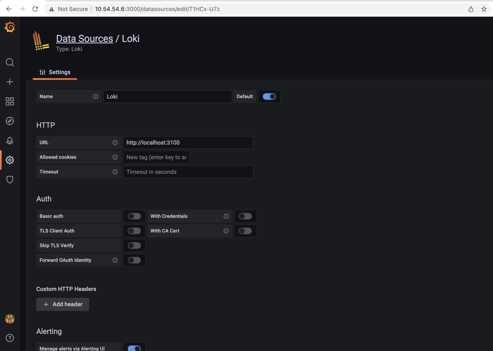
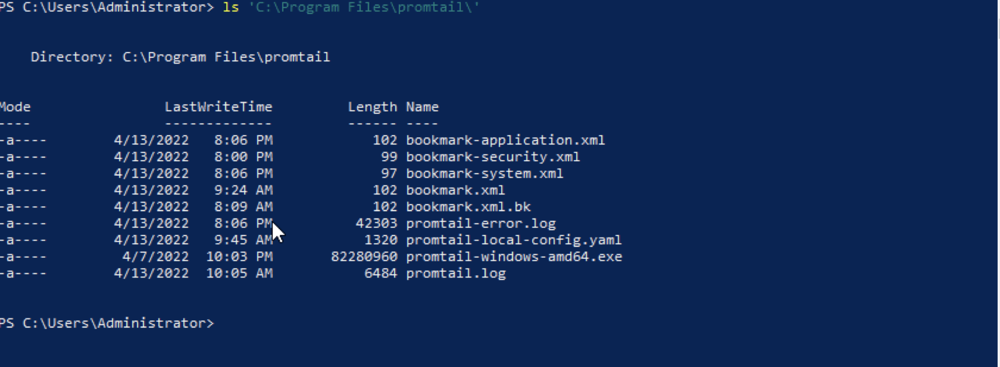
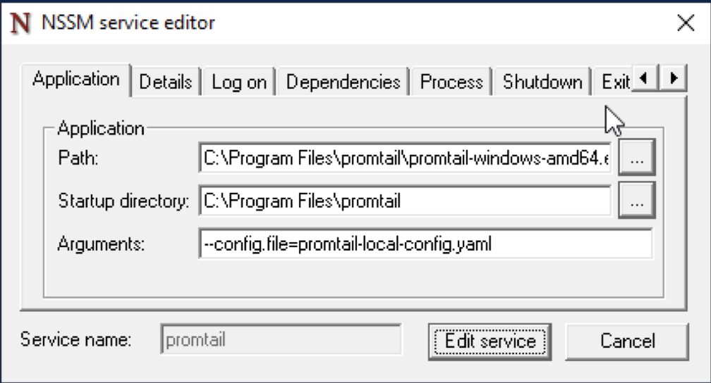
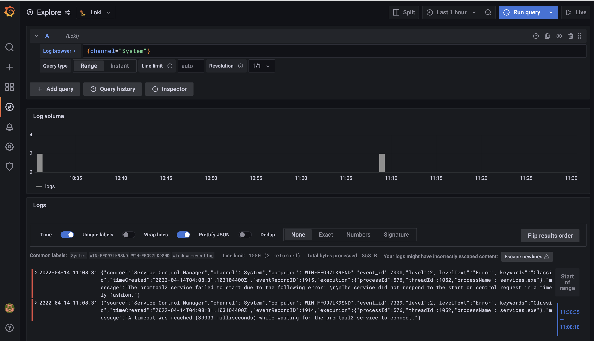

## Environment
```
# Servers
ag-rh2 : 10.54.54.6 (Grafana + Loki)
win2k19 : 10.54.54.219 (Promtail)

# OS Packages Release
RHEL 8.4
Windows Server 2019
Loki 2.5
Grafana 8.4.6
```

## Setup Loki
### 1. Download package Loki
```bash
curl -O -L "https://github.com/grafana/loki/releases/download/v2.5.0/loki-linux-amd64.zip"
```

### 2. Setup loki binary
```bash
# Unzip package
unzip loki-linux-amd64.zip

# Grant execute permission
chmod +x loki-linux-amd64

# Create directory for loki installation
sudo mkdir -p /opt/loki/{bin,conf,data}

# Move loki binary
mv loki-linux-amd64 /opt/loki/bin/loki
```
### 3. Setup loki configuration
Default configuration can be retrieved from [here](https://raw.githubusercontent.com/grafana/loki/master/cmd/loki/loki-local-config.yaml). I create loki config on `/opt/loki/config/loki-local-config.yaml` using below content:
```yaml
auth_enabled: false
 
server:
  http_listen_port: 3100
 
ingester:
  lifecycler:
    address: 127.0.0.1
    ring:
      kvstore:
        store: inmemory
      replication_factor: 1
    final_sleep: 0s
  chunk_idle_period: 1h       # Any chunk not receiving new logs in this time will be flushed
  max_chunk_age: 1h           # All chunks will be flushed when they hit this age, default is 1h
  chunk_target_size: 1048576  # Loki will attempt to build chunks up to 1.5MB, flushing first if chunk_idle_period or max_chunk_age is reached first
  chunk_retain_period: 30s    # Must be greater than index read cache TTL if using an index cache (Default index read cache TTL is 5m)
  max_transfer_retries: 0     # Chunk transfers disabled
  wal:
    dir: /opt/loki/data/wal
 
 
schema_config:
  configs:
    - from: 2020-10-24
      store: boltdb-shipper
      object_store: filesystem
      schema: v11
      index:
        prefix: index_
        period: 24h
 
storage_config:
  boltdb_shipper:
    active_index_directory: /opt/loki/data/boltdb-shipper-active
    cache_location: /opt/loki/data/boltdb-shipper-cache
    cache_ttl: 24h         # Can be increased for faster performance over longer query periods, uses more disk space
    shared_store: filesystem
  filesystem:
    directory: /opt/loki/data/chunks
 
compactor:
  working_directory: /opt/loki/data/boltdb-shipper-compactor
  shared_store: filesystem
  compaction_interval: 10m
  retention_enabled: true
  retention_delete_delay: 2h
  retention_delete_worker_count: 150
 
limits_config:
  reject_old_samples: true
  reject_old_samples_max_age: 168h
 
chunk_store_config:
  max_look_back_period: 0s
 
table_manager:
  retention_deletes_enabled: true
  retention_period: 30d
 
ruler:
  storage:
    type: local
    local:
      directory: /opt/loki/data/rules
  rule_path: /opt/loki/data/rules-temp
  alertmanager_url: http://localhost:9093
  ring:
    kvstore:
      store: inmemory
  enable_api: true

analytics:
  reporting_enabled: false
```

On above configuration, there is configuration for alertmanager but we will not include alertmanager installation in this post.

### 4. Create system user for loki
```bash
sudo useradd --system loki
```

### 5. Change permission on loki directory
```bash
# Change ownership
sudo chown -R loki:loki /opt/loki

# Restore SELinux label
sudo restorecon -vRF /opt/loki/
```

### 6. Run loki service on systemd
First, create systemd file for loki on `/etc/systemd/system/loki.service`. Paste below content.

```ini
[Unit]
Description=Loki service
After=network.target

[Service]
Type=simple
User=loki
ExecStart=/opt/loki/bin/loki -config.file /opt/loki/conf/loki-local-config.yaml
Restart=always

[Install]
WantedBy=multi-user.target
```
Then, run loki service.

```bash
sudo systemctl enable --now loki.service
```

### Open port for loki service
```bash
sudo firewall-cmd --add-port 3100/tcp --permanent
sudo firewall-cmd --reload
```

## Setup Grafana
### 1. Download Grafana RPM package
```bash
curl -O -L https://dl.grafana.com/oss/release/grafana-8.4.6-1.x86_64.rpm
```

### 2. Install package
```bash
sudo yum localinstall grafana-8.4.6-1.x86_64.rpm
```

### 3. Start grafana service
```bash
sudo systemctl enable --now grafana-server.service
```
### 4. Open port for grafana service
```bash
sudo firewall-cmd --add-port 3000/tcp --permanent
sudo firewall-cmd --reload
```
### 5. Add Loki datasource to Grafana.
Open grafana URL on 10.54.54.6:3000 then add Loki as datasource.


## Setup Promtail

### 1. Download promtail binary
To collect log from vent Viewer on Windows Server, we need to setup promtail. Binary file can be downloaded in [here](https://github.com/grafana/loki/releases/download/v2.5.0/promtail-windows-amd64.exe.zip). Move the exctracted file to `C:\Program Files\promtail`, see below for detail.


### 2. Create promtail configuration
For new installation, it should be contain only the binary file `promtail-windows-amd64.exe`. Then, create promtail configuration `promtail-local-config.yaml` with following content.
```yaml
server:
  http_listen_port: 9080
  grpc_listen_port: 0

clients:
  - url: http://10.54.54.6:3100/loki/api/v1/push

scrape_configs:
  - job_name: windows-application
    windows_events: 
      eventlog_name: "Application"
      xpath_query: "*[System[Level <= 3]]" # Critical, Error, Warning
      labels:
        logsource: windows-eventlog
      use_incoming_timestamp: true
      bookmark_path: "./bookmark-application.xml"
      exclude_event_data: true
    relabel_configs:
      - source_labels: ['computer']
        target_label: 'host'
  - job_name: windows-security
    windows_events: 
      eventlog_name: "Security"
      xpath_query: "*[System[Level <= 3]]"
      labels:
        logsource: windows-eventlog
      use_incoming_timestamp: true
      bookmark_path: "./bookmark-security.xml"
      exclude_event_data: true
      exclude_user_data: true
    relabel_configs:
      - source_labels: ['computer']
        target_label: 'host'
  - job_name: windows-system
    windows_events: 
      eventlog_name: "System"
      xpath_query: "*[System[Level <= 3]]"
      labels:
        logsource: windows-eventlog
      use_incoming_timestamp: true
      bookmark_path: "./bookmark-system.xml"
      exclude_event_data: true
      exclude_user_data: true
    relabel_configs:
      - source_labels: ['computer']
        target_label: 'host'
```

### 3. Test promtail
Test the configuration by running promtail directly via Powershell. Use Ctrl+C to stop program.
```bash
& 'C:\Program Files\promtail\promtail-windows-amd64.exe' --config.file='C:\Program Files\promtail\promtail-local-config.yaml'
```

### 4. Run promtail using windows service wrapper.
There are some service wrapper on Windows (sc.exe, nssm.exe and winsw). Windows has built in service wrapper: sc.exe, but when I use `sc.exe` to run promtail it always error: `StartService FAILED 1053`. I'm not really familiar with Windows Server, so still figuring out why this error appear. So, I use [nssm](https://nssm.cc/download) to wrap my promtail. You only need to download it and run below command.
```bash
'\nssm.exe install promtail
```
Boom, GUI windows will appear. Set the setting like below.


Confiure log file.
```bash
.\nssm.exe set promtail AppStderr 'C:\Program Files\promtail\promtail-error.log'
.\nssm.exe set promtail AppStdout 'C:\Program Files\promtail\promtail.log'
```

Then, start the service.
```bash
.\nssm.exe start promtail
```

### 5. Open Grafana to check incoming logs


References:

[Grafana Loki Storage Retention](https://grafana.com/docs/loki/latest/operations/storage/retention/)

[Log Scrapping made Easy with Grafana Loki in Windows](https://reachmnadeem.wordpress.com/2020/12/30/log-scrapping-made-easy-with-grafana-loki-in-windows/)

[Promtail Scraping (Service Discovery)](https://grafana.com/docs/loki/latest/clients/promtail/scraping/#windows-event-log)

