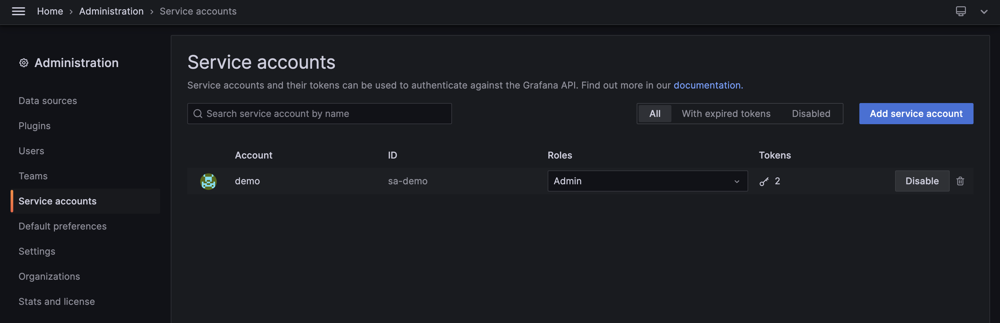

In this article I'll explain my process of analyzing and setting up Prometheus, where I ~~maybe effectively~~ increase query performance and addressed challenges related to cardinality. FYI, I use this stack on my monitoring system: Grafana, Promethues, Thanos. The metrics itself gethered from several source: node exporter, kube-state-metrics, etc.

## 1. List unused metrics
Firs, we need to list metrcis that used in our Grafana. To do this task, we can use mimirtool.
```bash
$ mimirtool analyze grafana --address=${GRAFANA_URL} --key="${GRAFANA_API_TOKEN}"
```
In my case, I execute this command:
```bash
$ mimirtool analyze grafana --address=https://grafana.rahmatawe.com --key="glsa_jLKvTx6RLkGXXXX6XKS6DXlrulepsy_xxxxx"
```
Anw, you can get `GRAFANA_API_TOKEN` by creating service account on Grafana dashboard.


Above command will generate file named `metrics-in-grafana.json`. Using this file, we will compare it to metrics stored in Prometheus. Then use below command to generate list of metrics that being used and unused.
```bash
#port forward to prometheus
$ kubectl port-forward prometheus-prometheus-0 9090:9090 -n monitoring

# Compare grafana metrics and
$ mimirtool analyze prometheus --grafana-metrics-file="metrics-in-grafana.json" --address=http://localhost:9090

INFO[0002] 73815 active series are being used in dashboards
INFO[0002] Found 2495 metric names
INFO[0017] 434700 active series are NOT being used in dashboards
INFO[0017] 467 in use active series metric count
INFO[0017] 2028 not in use active series metric count
```
**_NOTE:_**  Adjust `prometheus-prometheus-0` with your prometheus pod name and `monitoring` with namespace where your prometheus pod deployed.

It will generate file `prometheus-metrics.json`. Sort it.

```bash
$ jq -r ".in_use_metric_counts[].metric" prometheus-metrics.json | sort > used_metrics.txt
$ jq -r ".additional_metric_counts[].metric" prometheus-metrics.json | sort > unused_metrics.txt
```

2. Drop unused metrics
On step 1, we have been list used metrics and unused metrics. Next step, we will check metrics which have high cardinality via Prometheus dashboard http://localhost:9090/tsdb-status.


Hmm, let us check metrics `apiserver_request_duration_seconds_bucket`.
```bash
$ grep apiserver_request_duration_seconds_bucket u*_metrics.txt
unused_metrics.txt:apiserver_request_duration_seconds_bucket
```
We can drop this metrics since it's not used by Grafana. I will drop it via its ServiceMonitor. You can drop it other method (ex: prometheus config directly) depend on your setup.

```yaml
---
apiVersion: monitoring.coreos.com/v1
kind: ServiceMonitor
metadata:
  name: kube-apiserver
  namespace: monitoring
  labels:
    prometheus: main
    release: prometheus-operator

...

      metricRelabelings:
      - sourceLabels: ["__name__"]
        regex: 'apiserver_request_duration_seconds_bucket'
        action: drop

```

That's it. Simple task to drop your bloated Prometheus metrics. Bye!
