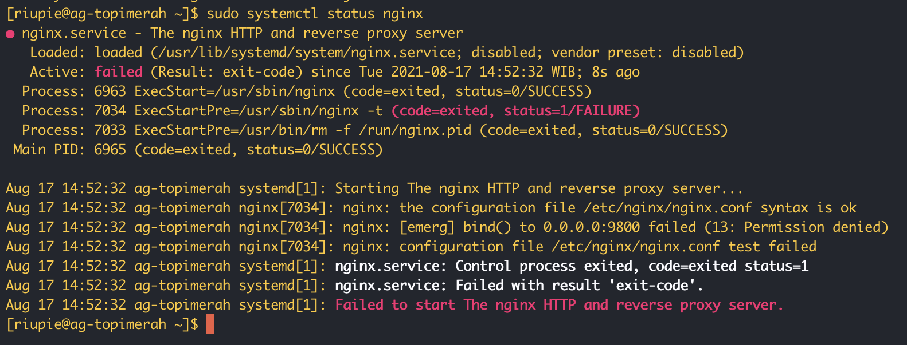
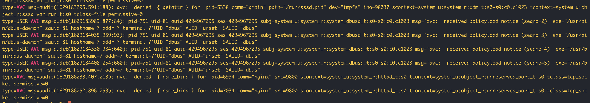
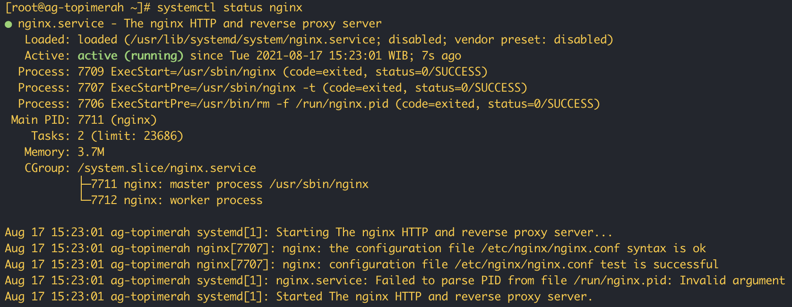

In this article I will give an example use case how to handle SELinux on Redhat/Centos/Fedora and its derivatives. Let say I want to install NGINX and expose my web on port 9800 and directory /app. Pretty simple, righ? I  just need to create simple config like below for example on save this config on `/etc/nginx/conf.d/web.conf`:

```config
server {
    listen 9800;
    server_tokens off;

    root /app;
    index index.html;

    location / {
        gzip_static on;
        try_files $uri /index.html;
    }
}
```

On /app directory, I only have index.html with value:

```bash
# cat /app/index.html
SeLinux Enabled
```

Then, I will restart my nginx service to apply this config and boom! I got an error: `nginx: [emerg] bind() to 0.0.0.0:9800 failed (13: Permission denied)`.



SELinux decisions, such as allowing or disallowing access, are cached. This cache is known as the Access Vector Cache (AVC). Denial messages are logged when SELinux denies access. You can find this log message on `/var/log/audit/audit.log` and find AVC log.

```bash
# cat /var/log/audit/audit.log | grep AVC
```

Let's look at the last log:



So, now I know that SELinux prevent us from using port 9800 on nginx service. I will copy the the message code on the last log `1629186752.896:253` and use that on the next step. For the next step I need a tool called `audit2why`.This tool is used to analyze what you have to execute when encounter SELinux issues.

```bash
# cat /var/log/audit/audit.log | grep 1629186752.896:253 | audit2why

bash: audit2why: command not found
```

I need to install the packages first. Find the needed package using below command:
```bash
# yum provides audit2why

Updating Subscription Management repositories.
Last metadata expiration check: 1:26:38 ago on Tue 17 Aug 2021 01:50:19 PM WIB.
policycoreutils-python-utils-2.8-16.1.el8.noarch : SELinux policy core python utilities
Repo        : rhel-8-for-x86_64-baseos-rpms
Matched from:
Filename    : /usr/bin/audit2why

policycoreutils-python-utils-2.9-3.el8.noarch : SELinux policy core python utilities
Repo        : rhel-8-for-x86_64-baseos-rpms
Matched from:
Filename    : /usr/bin/audit2why

policycoreutils-python-utils-2.9-3.el8_1.1.noarch : SELinux policy core python utilities
Repo        : rhel-8-for-x86_64-baseos-rpms
Matched from:
Filename    : /usr/bin/audit2why

policycoreutils-python-utils-2.9-9.el8.noarch : SELinux policy core python utilities
Repo        : rhel-8-for-x86_64-baseos-rpms
Matched from:
Filename    : /usr/bin/audit2why

policycoreutils-python-utils-2.9-14.el8.noarch : SELinux policy core python utilities
Repo        : rhel-8-for-x86_64-baseos-rpms
Matched from:
Filename    : /usr/bin/audit2why
```

Install the latest package:
```bash
# yum install policycoreutils-python-utils -y
```

Again, execute the audit2why:

```bash
# cat /var/log/audit/audit.log | grep 1629186752.896:253 | audit2why

type=AVC msg=audit(1629186752.896:253): avc:  denied  { name_bind } for  pid=7034 comm="nginx" src=9800 scontext=system_u:system_r:httpd_t:s0 tcontext=system_u:object_r:unreserved_port_t:s0 tclass=tcp_socket permissive=0

	Was caused by:
	The boolean nis_enabled was set incorrectly.
	Description:
	Allow nis to enabled

	Allow access by executing:
	# setsebool -P nis_enabled 1
```
Ok, so I need to enable `nis_enabled` policy and then restart nginx

```bash
# setsebool -P nis_enabled 1
# systemctl restart nginx
```


Afters nginx service running, check the web access using curl command:


---
