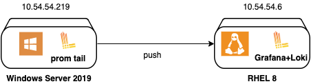
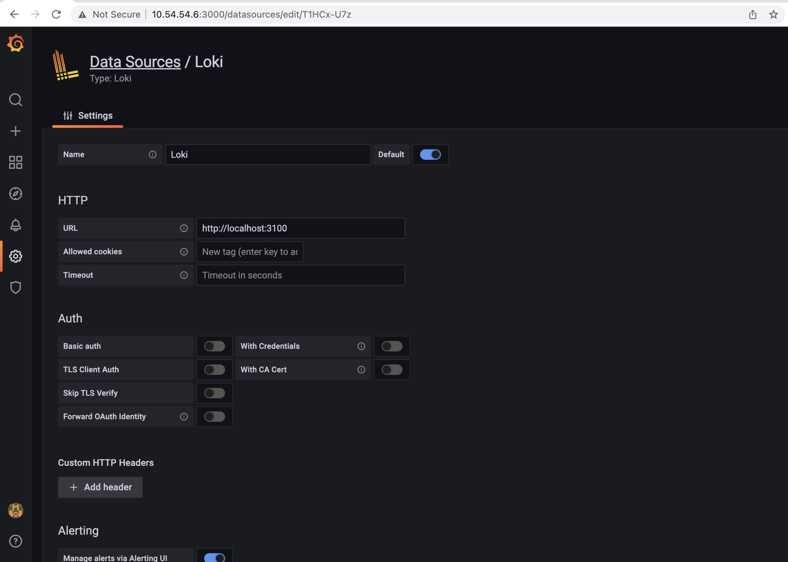
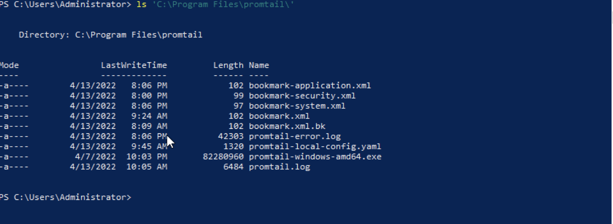
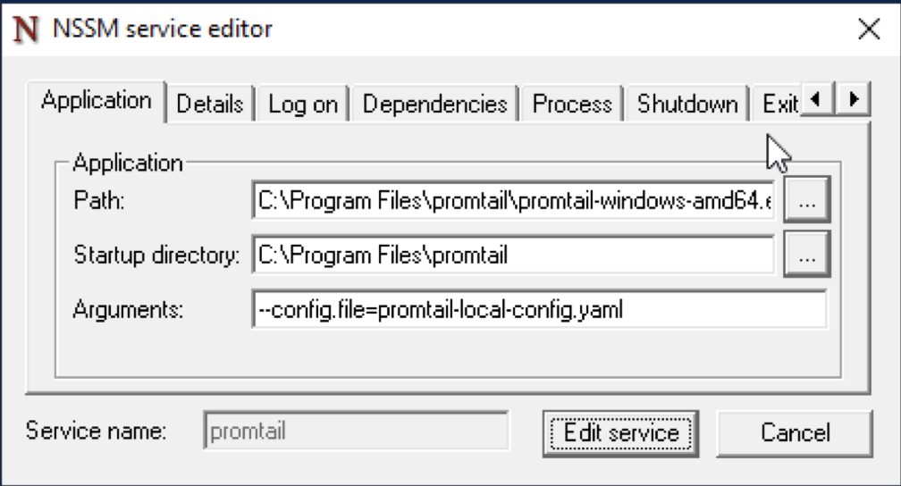

Dalam manajemen server, kemampuan untuk mengumpulkan, menganalisis, dan memvisualisasikan log dengan efisien sangatlah penting. Windows Server 2019 dilengkapi dengan Event Viewer, sebuah tool yang powerful untuk melihat dan mengelola log event. Di sisi lain, Grafana Loki adalah backend logging open-source yang memungkinkan untuk agregasi log dan query yang efisien. Mengintegrasikan log Event Viewer dari Windows Server 2019 ke Grafana Loki dapat secara signifikan meningkatkan kemampuan pemantauan dan pemecahan masalah dari infrastruktur kita. Panduan ini akan memberikan gambaran proses pengiriman log dari Event Viewer ke Grafana Loki untuk analisis dan visualisasi log yang terpusat.

### Environment

<div style="text-align:right"></div>

```
# Servers
ag-rh2 : 10.54.54.6 (Grafana + Loki)
win2k19 : 10.54.54.219 (Promtail)

# OS Packages Release
RHEL 8.4
Windows Server 2019
Loki 2.5
Grafana 8.4.6
```

### Setup Loki
#### 1. Download package Loki
```bash
curl -O -L "https://github.com/grafana/loki/releases/download/v2.5.0/loki-linux-amd64.zip"
```

#### 2. Setup loki binary
```bash
# Ekstrak paket
unzip loki-linux-amd64.zip

# Berikan izin eksekusi
chmod +x loki-linux-amd64

# Buat direktori untuk instalasi loki
sudo mkdir -p /opt/loki/{bin,conf,data}

# Pindahkan loki binary
mv loki-linux-amd64 /opt/loki/bin/loki
```
#### 3. Setup konfigurasi loki
Konfigurasi default dapat diperoleh dari [sini](https://raw.githubusercontent.com/grafana/loki/master/cmd/loki/loki-local-config.yaml). Saya membuat konfigurasi loki di `/opt/loki/config/loki-local-config.yaml` dengan isi berikut:
```yaml
auth_enabled: false
 
server:
  http_listen_port: 3100
 
ingester:
  lifecycler:
    address: 127.0.0.1
    ring:
      kvstore:
        store: inmemory
      replication_factor: 1
    final_sleep: 0s
  chunk_idle_period: 1h       # Any chunk not receiving new logs in this time will be flushed
  max_chunk_age: 1h           # All chunks will be flushed when they hit this age, default is 1h
  chunk_target_size: 1048576  # Loki will attempt to build chunks up to 1.5MB, flushing first if chunk_idle_period or max_chunk_age is reached first
  chunk_retain_period: 30s    # Must be greater than index read cache TTL if using an index cache (Default index read cache TTL is 5m)
  max_transfer_retries: 0     # Chunk transfers disabled
  wal:
    dir: /opt/loki/data/wal
 
 
schema_config:
  configs:
    - from: 2020-10-24
      store: boltdb-shipper
      object_store: filesystem
      schema: v11
      index:
        prefix: index_
        period: 24h
 
storage_config:
  boltdb_shipper:
    active_index_directory: /opt/loki/data/boltdb-shipper-active
    cache_location: /opt/loki/data/boltdb-shipper-cache
    cache_ttl: 24h         # Can be increased for faster performance over longer query periods, uses more disk space
    shared_store: filesystem
  filesystem:
    directory: /opt/loki/data/chunks
 
compactor:
  working_directory: /opt/loki/data/boltdb-shipper-compactor
  shared_store: filesystem
  compaction_interval: 10m
  retention_enabled: true
  retention_delete_delay: 2h
  retention_delete_worker_count: 150
 
limits_config:
  reject_old_samples: true
  reject_old_samples_max_age: 168h
 
chunk_store_config:
  max_look_back_period: 0s
 
table_manager:
  retention_deletes_enabled: true
  retention_period: 30d
 
ruler:
  storage:
    type: local
    local:
      directory: /opt/loki/data/rules
  rule_path: /opt/loki/data/rules-temp
  alertmanager_url: http://localhost:9093
  ring:
    kvstore:
      store: inmemory
  enable_api: true

analytics:
  reporting_enabled: false
```

Pada konfigurasi di atas, terdapat konfigurasi untuk AlertManager, tetapi saya tidak akan menyertakan instalasi AlertManager dalam artikel ini.

#### 4. Buat system user untuk loki
```bash
sudo useradd --system loki
```

#### 5. Ubah permission pada direktori loki
```bash
# Ubah ownership
sudo chown -R loki:loki /opt/loki

# Restore SELinux label
sudo restorecon -vRF /opt/loki/
```

#### 6. Jalankan service loki dengan systemd
Pertama, buat file systemd untuk loki di `/etc/systemd/system/loki.service`. Salin konfigurasi berikut.

```ini
[Unit]
Description=Loki service
After=network.target

[Service]
Type=simple
User=loki
ExecStart=/opt/loki/bin/loki -config.file /opt/loki/conf/loki-local-config.yaml
Restart=always

[Install]
WantedBy=multi-user.target
```
Lalu, jalankan service loki.

```bash
sudo systemctl enable --now loki.service
```

#### 7. Open port untuk service loki
```bash
sudo firewall-cmd --add-port 3100/tcp --permanent
sudo firewall-cmd --reload
```

### Setup Grafana
#### 1. Download Grafana RPM package
```bash
curl -O -L https://dl.grafana.com/oss/release/grafana-8.4.6-1.x86_64.rpm
```

#### 2. Install package
```bash
sudo yum localinstall grafana-8.4.6-1.x86_64.rpm
```

#### 3. Jalankan service grafana
```bash
sudo systemctl enable --now grafana-server.service
```
#### 4. Open port untuk service grafana
```bash
sudo firewall-cmd --add-port 3000/tcp --permanent
sudo firewall-cmd --reload
```
#### 5. Tambahkan datasource Loki di Grafana.
Buka URL grafana on 10.54.54.6:3000 lalu tambahkan loki sebagai datasource.


### Setup Promtail

#### 1. Download promtail binary
TUntuk mengumpulkan log dari Event Viewer di Windows Server, kita perlu setup promtail. Binary file dapat diunduh di [sini](https://github.com/grafana/loki/releases/download/v2.5.0/promtail-windows-amd64.exe.zip). Pindahkan file yang diekstrak ke `C:\Program Files\promtail`, lihat detailnya di bawah.

Untuk instalasi baru, seharusnya hanya berisi binary file `promtail-windows-amd64.exe`.

#### 2. Buat konfigurasi promtail
Buat file konfigurasi promtail `promtail-local-config.yaml` dengan isi berikut.
```yaml
server:
  http_listen_port: 9080
  grpc_listen_port: 0

clients:
  - url: http://10.54.54.6:3100/loki/api/v1/push

scrape_configs:
  - job_name: windows-application
    windows_events: 
      eventlog_name: "Application"
      xpath_query: "*[System[(Level=1 or Level=2 or Level=3)]]" # Critical, Error, Warning
      labels:
        logsource: windows-eventlog
      use_incoming_timestamp: true
      bookmark_path: "./bookmark-application.xml"
      exclude_event_data: true
    pipeline_stages:
    - json:
        expressions:
          level: levelText
    - labels: 
        level:
    relabel_configs:
      - source_labels: ['computer']
        target_label: 'host'
  - job_name: windows-security
    windows_events: 
      eventlog_name: "Security"
      xpath_query: "*[System[(Level=1 or Level=2 or Level=3)]]"
      labels:
        logsource: windows-eventlog
      use_incoming_timestamp: true
      bookmark_path: "./bookmark-security.xml"
      exclude_event_data: true
      exclude_user_data: true
    pipeline_stages:
    - json:
        expressions:
          level: levelText
    - labels: 
        level:
    relabel_configs:
      - source_labels: ['computer']
        target_label: 'host'
  - job_name: windows-system
    windows_events: 
      eventlog_name: "System"
      xpath_query: "*[System[(Level=1 or Level=2 or Level=3)]]"
      labels:
        logsource: windows-eventlog
      use_incoming_timestamp: true
      bookmark_path: "./bookmark-system.xml"
      exclude_event_data: true
      exclude_user_data: true
    pipeline_stages:
    - json:
        expressions:
          level: levelText
    - labels: 
        level:
    relabel_configs:
      - source_labels: ['computer']
        target_label: 'host'
```

#### 3. Test promtail
Uji konfigurasi dengan menjalankan promtail langsung melalui Powershell. Gunakan Ctrl+C untuk menghentikan program.
```bash
& 'C:\Program Files\promtail\promtail-windows-amd64.exe' --config.file='C:\Program Files\promtail\promtail-local-config.yaml'
```

#### 4. Jalankan promtail menggunakan windows service wrapper.
Ada beberapa service wrapper di Windows, contohnya: sc.exe, nssm.exe, dan winsw. Windows memiliki service wrapper bawaan: sc.exe, tetapi saat saya menggunakan `sc.exe` untuk menjalankan promtail, selalu muncul error:: `StartService FAILED 1053`. Saya tidak terlalu familiar dengan Windows Server, jadi masih mencari tahu mengapa kesalahan ini muncul. Jadi, saya menggunakan [nssm](https://nssm.cc/download) sebagai service wrapper untuk promtail. Kalian hanya perlu mengunduhnya, ekstrak, dan jalankan perintah di bawah ini.
```bash
.\nssm.exe install promtail
```
Boom, GUI windows akan muncul. Atur konfigurasi berikut.

Kalian juga dapat  mem-bypass GUI, dengan `.\nssm install <servicename> <application> [<options>]`.

Setelah layanan dibuat, konfigurasikan file log.
```bash
.\nssm.exe set promtail AppStderr 'C:\Program Files\promtail\promtail-error.log'
.\nssm.exe set promtail AppStdout 'C:\Program Files\promtail\promtail.log'
```

Lalu, jalankan service.
```bash
.\nssm.exe start promtail
```

#### 5. Buka Grafana untuk memeriksa log yang masuk


References:

[Grafana Loki Storage Retention](https://grafana.com/docs/loki/latest/operations/storage/retention/)

[Log Scrapping made Easy with Grafana Loki in Windows](https://reachmnadeem.wordpress.com/2020/12/30/log-scrapping-made-easy-with-grafana-loki-in-windows/)

[Promtail Scraping (Service Discovery)](https://grafana.com/docs/loki/latest/clients/promtail/scraping/#windows-event-log)

[Stages](https://grafana.com/docs/loki/latest/clients/promtail/stages/)
