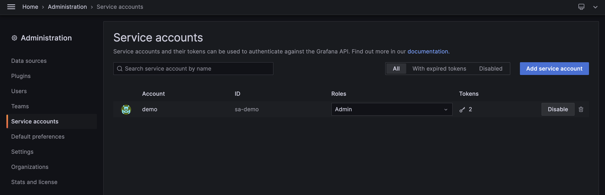
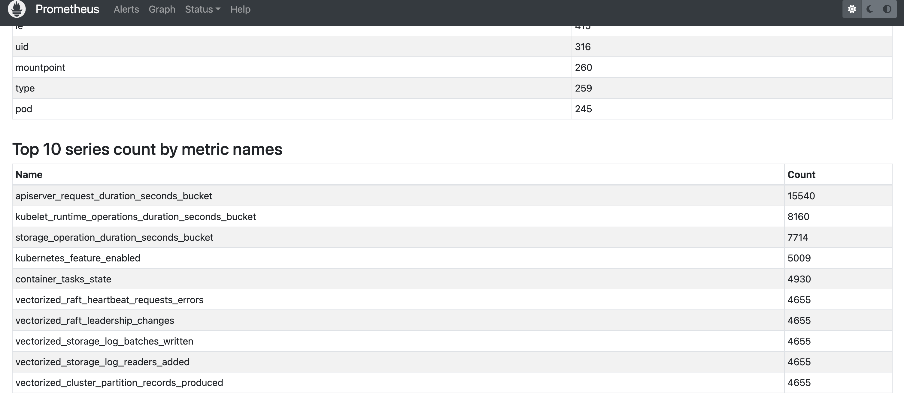

Dalam artikel ini, saya akan menjelaskan proses saya dalam menganalisa dan menyiapkan Prometheus, di mana ~~mungkin efektif~~ meningkatkan kinerja qeury dan juga untuk menangani kendala terkait kardinalitas. Untuk informasi, saya menggunakan technology stack berikut untuk system monitoring: Grafana, Prometheus, Thanos. Untuk metrics sendiri dikumpulkan dari beberapa sumber: node exporter, kube-state-metrics, dll.

## 1. List metrics yang tidak terpakai
Pertama, kita perlu membuat daftar metrics yang digunakan oleh Grafana. Untuk melakukan tugas ini, kita dapat menggunakan `mimirtool`.

```bash
$ mimirtool analyze grafana --address=${GRAFANA_URL} --key="${GRAFANA_API_TOKEN}"
```
Dalam kasus ini, saya mengeksekusi perintah berikut:
```bash
$ mimirtool analyze grafana --address=https://grafana.rahmatawe.com --key="glsa_jLKvTx6RLkGXXXX6XKS6DXlrulepsy_xxxxx"
```
Variabel `GRAFANA_API_TOKEN` dapat diperoleh dengan membuat service account di Grafana dashboard.


Perintah diatas akan menghasilkan output file `metrics-in-grafana.json`. Dengan file ini, kita akan melakukan perbandingan dengan metrics yang ada di Prometheus.

```bash
#port forward ke prometheus
$ kubectl port-forward prometheus-prometheus-0 9090:9090 -n monitoring

# Membandingkan grafana metrics and prometheus
$ mimirtool analyze prometheus --grafana-metrics-file="metrics-in-grafana.json" --address=http://localhost:9090

INFO[0002] 73815 active series are being used in dashboards
INFO[0002] Found 2495 metric names
INFO[0017] 434700 active series are NOT being used in dashboards
INFO[0017] 467 in use active series metric count
INFO[0017] 2028 not in use active series metric count
```
**_NOTE:_**  Sesuaikan `prometheus-prometheus-0` dengan nama pod prometheus kalian dan `monitoring` dengan namespace dimana kamu men-deploy prometheus mu.

Eksekusi diatas akan menghasilkan file `prometheus-metrics.json`. Kemudian lakukan sorting.

```bash
$ jq -r ".in_use_metric_counts[].metric" prometheus-metrics.json | sort > used_metrics.txt
$ jq -r ".additional_metric_counts[].metric" prometheus-metrics.json | sort > unused_metrics.txt
```

## 2. Menghapus metrics yang tidak terpakai
Pada langkah 1, kita telah membuat daftar metrics yang terpakai dan tidak terpakai. Langkah selanjutnya, kita akan memeriksa metrics yang memiliki kardinalitas tinggi melalui dasboard Prometheus http://localhost:9090/tsdb-status.


Hmm, mari kita cek metric `apiserver_request_duration_seconds_bucket`.
```bash
$ grep apiserver_request_duration_seconds_bucket u*_metrics.txt
unused_metrics.txt:apiserver_request_duration_seconds_bucket
```
Kita bisa menghapus metric ini karena tidak digunakan oleh Grafana. Saya akan menghapusnya melalui ServiceMonitor. Kalian dapat menghapusnya dengan metode lain (misalnya: melalui config file prometheus langsung) tergantung pada setup kalian.

```yaml
---
apiVersion: monitoring.coreos.com/v1
kind: ServiceMonitor
metadata:
  name: kube-apiserver
  namespace: monitoring
  labels:
    prometheus: main
    release: prometheus-operator

...

      metricRelabelings:
      - sourceLabels: ["__name__"]
        regex: 'apiserver_request_duration_seconds_bucket'
        action: drop

```

Itu saja. Task simpel untuk menghapus metrics Prometheus yang tidak digunakan. Bye!

Ref:
* https://medium.com/@dotdc/prometheus-performance-and-cardinality-in-practice-74d5d9cd6230
* https://www.robustperception.io/dropping-metrics-at-scrape-time-with-prometheus/
